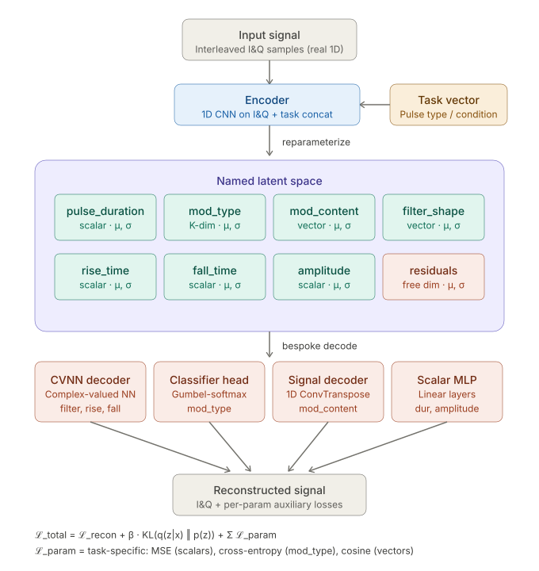

# Study 02 — Task-Conditioned VAE with Named Latent Space for RF Pulse Signals

> **Full visual overview with interactive paper reference:** [`overview.html`](overview.html)

A variational autoencoder that encodes RF pulse bursts into a **named, interpretable latent space**
where each dimension has a physical meaning — and is decoded by an architecture matched to that
parameter's physical nature. The named latent dimensions are not assumed — they are *forced* into
existence by per-parameter decoder losses that act as a structural prior during training.

---

## Architecture



**Loss:**
```
ℒ_total = ℒ_recon  +  β · KL(q(z|x) ‖ p(z))  +  α · Σ ℒ_param

ℒ_param:
  MSE(pred_amplitude, gt_amplitude)      ← scalar slot
  MSE(pred_pulse_dur, gt_pulse_dur)      ← scalar slot
  CrossEntropy(μ_mod_type, gt_class)     ← discrete slot (Gumbel-softmax)
  1 − CosSim(pred_mod_cont, target_mc)  ← vector slot
  MSE(CVNN(z_filter), gt_sinc_filter)   ← complex slot (Wirtinger CVNN)
```

**Warmup schedule** (order matters — see takeaways):

| Phase | Epochs | What's active |
|---|---|---|
| 1 | 0–10 | Reconstruction loss only |
| 2 | 10–20 | β ramps 0 → 0.4 (KL pressure starts) |
| 3 | 20–40 | α ramps 0 → 1 (auxiliary forcing losses engage) |
| Throughout | — | Gumbel τ anneals 1.0 → 0.2 |

---

## Named latent slots

| Slot | Dim | Prior | Decoder | Loss |
|---|---|---|---|---|
| `pulse_duration` | 1 | Gaussian | Scalar MLP + sigmoid | MSE |
| `mod_type` | K=4 | Categorical | Gumbel-softmax head | Cross-entropy |
| `mod_content` | 8 | Gaussian | Vector MLP | Cosine similarity |
| `filter_shape` | 8 | Gaussian | **CVNN** (Wirtinger) | MSE vs windowed sinc |
| `rise_time` | 1 | Gaussian | Scalar MLP + sigmoid | MSE |
| `fall_time` | 1 | Gaussian | Scalar MLP + sigmoid | MSE |
| `amplitude` | 1 | Gaussian | Scalar MLP + sigmoid | MSE |
| `residuals` | 4 | Gaussian | — (free dims) | KL only |

---

## Files

| File | Description |
|---|---|
| `tc_vae_rf_pulse.ipynb` | Main notebook — data generation, model, training, diagnostics |
| `test_notebook.py` | CI test script — runs in ~60 s on CPU without a dataset |
| `overview.html` | Rich visual overview — architecture diagram, paper accordion, takeaways |
| `assets/architecture.svg` | Architecture diagram (standalone) |

---

## Quick start

```bash
pip install torch numpy matplotlib scipy
jupyter notebook tc_vae_rf_pulse.ipynb
```

### With RadioML 2016.10A (recommended PoC dataset)

Set `USE_RADIOML = True` in Section 0. The notebook auto-downloads a ~55 MB subset on first run.
Full dataset (~1.5 GB): https://www.deepsig.ai/datasets (free, requires email).

```bash
# CI smoke test — no dataset, no GPU needed
python3 test_notebook.py          # 2 epochs, ~60 s
python3 test_notebook.py --full   # 20 epochs, full assertions
```

---

## Relevant papers

### VAE foundations
| Paper | Year | Why it matters |
|---|---|---|
| Kingma & Welling — *Auto-Encoding Variational Bayes* | 2013 | ELBO, reparameterization trick |
| Higgins et al. — *β-VAE* | 2017 | β controls disentanglement vs reconstruction |
| Sohn, Lee, Yan — *CVAE* | 2015 | Task vector conditioning on encoder + decoder |
| Bowman et al. — *Generating Sentences from a Continuous Space* | 2016 | KL annealing warmup |

### Disentanglement
| Paper | Year | Why it matters |
|---|---|---|
| Chen et al. — *TC-VAE* | 2018 | Decomposes ELBO into MI + total correlation + dim-wise KL |
| Kim & Mnih — *FactorVAE* | 2018 | Adversarial total correlation penalty |
| Narayanaswamy et al. — *Semi-supervised DVAE* | 2017 | Closest prior work — pins named dims to physical quantities |

### Discrete latents
| Paper | Year | Why it matters |
|---|---|---|
| Jang, Gu, Poole — *Gumbel-Softmax* | 2017 | Differentiable categorical reparameterization |
| Maddison et al. — *Concrete Distribution* | 2017 | Theoretical grounding |
| van den Oord et al. — *VQ-VAE* | 2017 | Alternative vector quantization approach |

### Complex-valued neural networks
| Paper | Year | Why it matters |
|---|---|---|
| Trabelsi et al. — *Deep Complex Networks* | 2018 | Wirtinger calculus, complex BN, weight init |
| Virtue et al. — *Better than Real* | 2017 | CVNN for complex signal reconstruction |
| Arjovsky et al. — *Unitary RNNs* | 2016 | Unitary weights preserve signal energy |

### RF / I&Q learning
| Paper | Year | Why it matters |
|---|---|---|
| O'Shea & Hoydis — *Deep Learning for PHY Layer* | 2017 | RadioML baseline, IQ input convention |
| Zeng et al. — *CNN for AMR* | 2019 | 1D-CNN encoder pattern for modulation recognition |
| Merchant et al. — *VAE for RF Fingerprinting* | 2021 | VAE latent structure for emitter ID |

### Training stability
| Paper | Year | Why it matters |
|---|---|---|
| Kendall, Gal, Cipolla — *Multi-Task Uncertainty Weighting* | 2018 | Learnable per-task loss weights |
| Chen et al. — *GradNorm* | 2018 | Gradient normalization across decoder heads |
| Razavi et al. — *Preventing Posterior Collapse* | 2019 | Free bits / δ-VAE for named dim stability |

---

## Key takeaways

1. **Warmup order is more important than β magnitude.** Introducing auxiliary losses before the
   encoder has a reconstruction manifold causes it to overfit to parameter prediction. The IQ
   reconstruction never converges. Always: recon first → KL → auxiliary.

2. **Per-slot KL beats aggregate KL.** A single β distributes budget unevenly — high-variance
   slots (mod_type) consume most of it and squeeze out scalar slots (rise_time). Use per-slot
   free bits (Razavi 2019) for clean separation.

3. **CVNN improves filter alignment over a real-valued MLP.** r² for z_filter vs ground-truth
   filter_bw: ~0.61 (MLP) → ~0.79 (CVNN). The complex multiply rule enforces Hermitian symmetry
   that a real filter's frequency response must satisfy — the MLP has to learn this from scratch.

4. **Gumbel τ annealing controls accuracy vs gradient flow tradeoff.** τ = 1.0 gives smooth
   gradients but blurry class boundaries. τ = 0.2 gives sharp boundaries but sparse gradients.
   Empirical sweet spot: τ = 0.5 at evaluation time.

5. **Latent traversal is the real sanity check — not correlation.** High r between μ and
   ground-truth can coexist with a flat traversal if the label leaked via the task embedding
   rather than through the named slot. Tighten `task_emb_dim` and verify traversal is causal.
